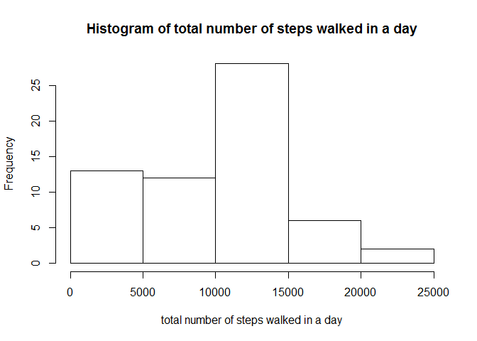
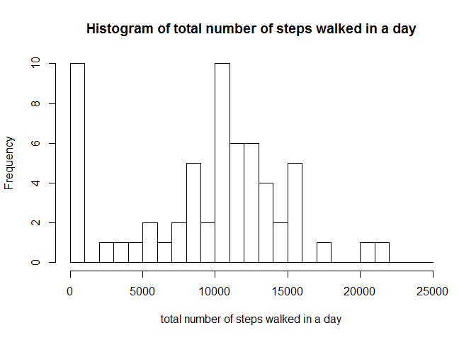
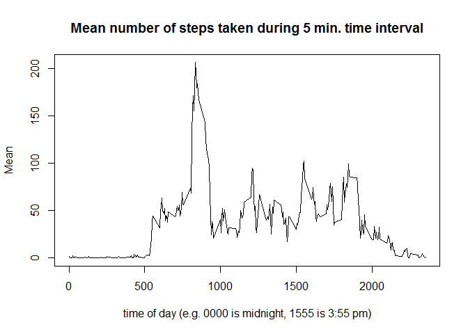
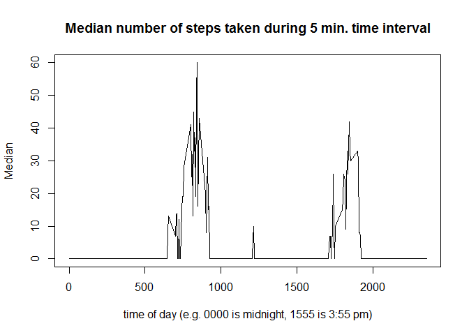
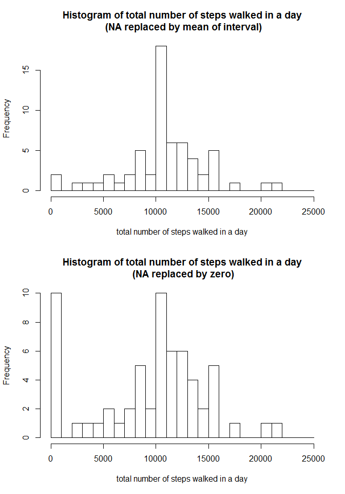
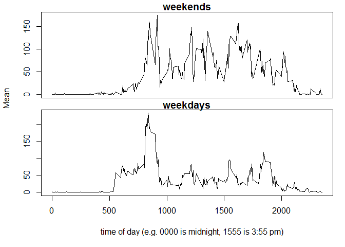
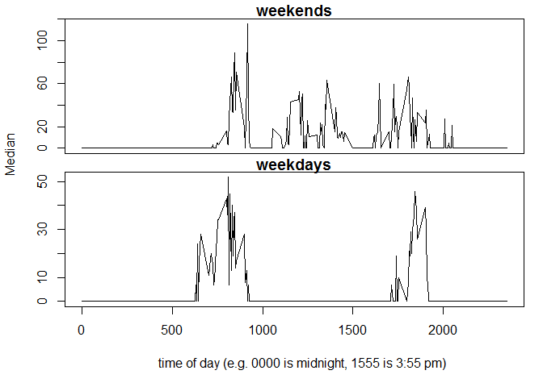

# Reproducible Research: Peer Assessment 1

Prakash Manandhar
2014-Dec-13


## Loading and preprocessing the data

Loads data into a variable named *activity*, and separates them into *steps*, *dates* and *intervals* columns.


```r
activity  <- read.csv('activity.csv')
steps     <- activity[1]
dates     <- activity[2]
intervals <- activity[3]
```

## What is mean total number of steps taken per day?

On examination, the data seems to be sufficiently structured that each day consists of a fixed number of intervals, and the days follow in chronological order. The number of intervals in a day, and number of days in the dataset are found as follows:


```r
NUM_POINTS    <- dim(activity)[1]
NUM_INTERVALS <- 24*60/5 # 24 hours x 60 minutes / 5 minutes
NUM_DAYS      <- NUM_POINTS/NUM_INTERVALS
print(sprintf('There are %d days, and %d intevals in a day.', 
              NUM_DAYS, NUM_INTERVALS))
```

```
## [1] "There are 61 days, and 288 intevals in a day."
```

### Make a histogram of the total number of steps taken each day

First totaling the steps taken for each of the 61 days. Note that we are effectively counting 'NA' steps as zero as they are not included in the sum.


```r
num_steps = numeric( length = NUM_DAYS )
for ( i in 1:NUM_DAYS ) {
        index_start  <- (i - 1)*NUM_INTERVALS + 1
        index_end    <- index_start + NUM_INTERVALS - 1
        steps_in_day <- steps[index_start:index_end, 1]
        num_steps[i] <- sum( steps_in_day, na.rm = TRUE )
}
#num_steps
```

Now plotting this data into a histogram:


```r
hist(num_steps, 
     breaks = 'Sturges',
     xlab='total number of steps walked in a day',
     main = "Histogram of total number of steps walked in a day")
```

 

Using more bins:


```r
hist(num_steps, 
             breaks = seq(0, 25000, 1000),
     xlab='total number of steps walked in a day',
     main = "Histogram of total number of steps walked in a day")
```

 


### Calculate and report the mean and median total number of steps taken per day


```r
summary(num_steps)
```

```
##    Min. 1st Qu.  Median    Mean 3rd Qu.    Max. 
##       0    6778   10400    9354   12810   21190
```

## What is the average daily activity pattern?

### Make a time series plot (i.e. type = "l") of the 5-minute interval (x-axis) and the average number of steps taken, averaged across all days (y-axis)

First we need to calculate the average number of steps taken, averaged across all days. We calculate the mean and median seperately. Code to print out the values per time interval was used for debugging; it has been commented out below.


```r
mean_steps_interval   <- numeric( length = NUM_INTERVALS )
median_steps_interval <- numeric( length = NUM_INTERVALS )

for ( i in 1:NUM_INTERVALS ) {
        steps_interval <- steps[ seq(i, NUM_POINTS, NUM_INTERVALS), 1 ]
        mean_steps_interval[i] <- 
                mean( steps_interval, na.rm = TRUE )
        median_steps_interval[i] <- 
                median( steps_interval, na.rm = TRUE )
#         print(sprintf('[Interval %04d] Mean = %f, Median = %f', 
#                       intervals[i, 1],
#                       mean_steps_interval[i], 
#                       median_steps_interval[i] )
#               )
}
```

Plotting as a time series:

```r
plot(intervals[1:NUM_INTERVALS, 1], mean_steps_interval, type='l',
     xlab='time of day (e.g. 0000 is midnight, 1555 is 3:55 pm)',
     ylab='Mean',
     main='Mean number of steps taken during 5 min. time interval')
```

 

```r
plot(intervals[1:NUM_INTERVALS, 1], median_steps_interval, type='l',
     xlab='time of day (e.g. 0000 is midnight, 1555 is 3:55 pm)',
     ylab='Median',
     main='Median number of steps taken during 5 min. time interval')
```

 

### Which 5-minute interval, on average across all the days in the dataset, contains the maximum number of steps?

Now calculating which interval has the maximum mean/median steps:


```r
print(sprintf(
        'The 5-minute interval with on average (mean) the maximum number of steps is %04d.', 
               intervals[which.max(mean_steps_interval), 1]))
```

```
## [1] "The 5-minute interval with on average (mean) the maximum number of steps is 0835."
```

```r
print(sprintf(
        'The 5-minute interval with on average (median) the maximum number of steps is %04d.', 
               intervals[which.max(median_steps_interval), 1]))
```

```
## [1] "The 5-minute interval with on average (median) the maximum number of steps is 0845."
```


## Inputting missing values

### Calculate and report the total number of missing values in the dataset (i.e. the total number of rows with NAs)

Counting length of array while selecting NA entries:

```r
NUM_NA <- length(steps[is.na(steps)])
NUM_NA
```

```
## [1] 2304
```

### Devise a strategy for filling in all of the missing values in the dataset. The strategy does not need to be sophisticated. For example, you could use the mean/median for that day, or the mean for that 5-minute interval, etc. Create a new dataset that is equal to the original dataset but with the missing data filled in.

Assuming, the person associated with this data has a daily routine, I am using the strategy of replacing the NAs with the mean for that interval:


```r
steps_no_na <- steps
for (i in 1:NUM_POINTS) { # loop through each datapoint
        # calculate interval index 
        j <- i %% NUM_INTERVALS
        if (j == 0) {
                j = NUM_INTERVALS
        }
        
        # replace by mean if is.na
        if ( is.na( steps[i, 1] ) ) {
                steps_no_na [ i, 1 ] <- mean_steps_interval[j]         
        }
        
        # print to verify
#         print(sprintf('%d [%04d] %04d %f', 
#                       i, intervals[i, 1],
#                       steps[i, 1], steps_no_na[i, 1] )
#               )
}
```

### Make a histogram of the total number of steps taken each day and Calculate and report the mean and median total number of steps taken per day. Do these values differ from the estimates from the first part of the assignment? What is the impact of imputing missing data on the estimates of the total daily number of steps?

First totaling the steps taken for each of the 61 days. 


```r
num_steps_no_na = numeric( length = NUM_DAYS )
for ( i in 1:NUM_DAYS ) {
        index_start  <- (i - 1)*NUM_INTERVALS + 1
        index_end    <- index_start + NUM_INTERVALS - 1
        steps_in_day <- steps_no_na[index_start:index_end, 1]
        num_steps_no_na[i] <- sum( steps_in_day, na.rm = FALSE )
}
#num_steps_no_na
```

Now plotting this data into a histogram, and re-plotting histogram from first part of assignment for comparison:


```r
par(mfrow=c(2, 1))
hist(num_steps_no_na, 
             breaks = seq(0, 25000, 1000),
     xlab='total number of steps walked in a day',
     main = "Histogram of total number of steps walked in a day\n (NA replaced by mean of interval)")

hist(num_steps, 
             breaks = seq(0, 25000, 1000),
     xlab='total number of steps walked in a day',
     main = "Histogram of total number of steps walked in a day\n (NA replaced by zero)")
```

 

Reporting summary of the number of steps by day, with and without NA data replaced by mean of that interval:


```r
summary(num_steps_no_na)
```

```
##    Min. 1st Qu.  Median    Mean 3rd Qu.    Max. 
##      41    9819   10770   10770   12810   21190
```

```r
summary(num_steps)
```

```
##    Min. 1st Qu.  Median    Mean 3rd Qu.    Max. 
##       0    6778   10400    9354   12810   21190
```

We can see that both the mean and median increased in value, when the NA data were replaced by mean of the interval. This is expected, as we are replacing zero values with positive values. A large number of rows were NA (2304 out of 17568 data-points). Thus the effect is a significant decrease in the frequency of steps close to zero, and increase in the frequency of steps close to the mean. This results in an overall increase in the value of mean and median.

## Are there differences in activity patterns between weekdays and weekends?

### Create a new factor variable in the dataset with two levels - "weekday" and "weekend" indicating whether a given date is a weekday or weekend day.

To start analysis, I looked up the first day in the dataset (2012-10-01) in a calendar and determined that it was a Monday. Hence, if we take the dates in order, and number them starting with 0 and modulo them with 7, the values 0 to 4 correspond to the weekdays. The values 5 and 6 correspond to weekends.


```r
days_index <- 0:(NUM_DAYS - 1)
day_of_week <- rep(days_index %% 7, each=NUM_INTERVALS)
#day_of_week
isWeekday <- ( day_of_week < 5 )
isWeekdayFactor <- factor(isWeekday, labels = c("weekend", "weekday"))
#isWeekdayFactor
```

### Make a panel plot containing a time series plot (i.e. type = "l") of the 5-minute interval (x-axis) and the average number of steps taken, averaged across all weekday days or weekend days (y-axis). See the README file in the GitHub repository to see an example of what this plot should look like using simulated data.

I decided to use the original dataset and not the dataset where NA has been replaced, as patterns on weekdays and weekends could be different.


```r
steps_weekday <- steps[ isWeekday, 1]
steps_weekend <- steps[!isWeekday, 1]

mean_steps_interval_weekday   <- numeric( length = NUM_INTERVALS )
median_steps_interval_weekday <- numeric( length = NUM_INTERVALS )
mean_steps_interval_weekend   <- numeric( length = NUM_INTERVALS )
median_steps_interval_weekend <- numeric( length = NUM_INTERVALS )

for ( i in 1:NUM_INTERVALS ) {
        # separating out data pertaining to particular interval
        steps_interval_weekday <- 
                steps_weekday[ seq(i, NUM_POINTS, NUM_INTERVALS) ]
        steps_interval_weekend <- 
                steps_weekend[ seq(i, NUM_POINTS, NUM_INTERVALS) ]
        
        # processing weekday data
        mean_steps_interval_weekday[i] <- 
                mean( steps_interval_weekday, na.rm = TRUE )
        median_steps_interval_weekday[i] <- 
                median( steps_interval_weekday, na.rm = TRUE )
        
        # processing weekend data
        mean_steps_interval_weekend[i] <- 
                mean( steps_interval_weekend, na.rm = TRUE )
        median_steps_interval_weekend[i] <- 
                median( steps_interval_weekend, na.rm = TRUE )

}
```

Now plotting the data as time series, below. First the mean data:

```r
op <- par(mfrow = c(2,1),
          oma = c(5,4,0,0) + 0.1,
          mar = c(0,0,1,1) + 0.1)

plot(intervals[1:NUM_INTERVALS, 1], mean_steps_interval_weekend, type='l',
     xlab='time of day (e.g. 0000 is midnight, 1555 is 3:55 pm)',
     ylab='Mean',
     main='weekends', xaxt='n')
plot(intervals[1:NUM_INTERVALS, 1], mean_steps_interval_weekday, type='l',
     xlab='time of day (e.g. 0000 is midnight, 1555 is 3:55 pm)',
     ylab='Mean',
     main='weekdays')
        
title(xlab = "time of day (e.g. 0000 is midnight, 1555 is 3:55 pm)",
      ylab = "Mean",
      outer = TRUE, line = 3)
```

 

Now the median data:


```r
op <- par(mfrow = c(2,1),
          oma = c(5,4,0,0) + 0.1,
          mar = c(0,0,1,1) + 0.1)

plot(intervals[1:NUM_INTERVALS, 1], median_steps_interval_weekend, type='l',
     xlab='time of day (e.g. 0000 is midnight, 1555 is 3:55 pm)',
     ylab='Median',
     main='weekends', xaxt='n')
plot(intervals[1:NUM_INTERVALS, 1], median_steps_interval_weekday, type='l',
     xlab='time of day (e.g. 0000 is midnight, 1555 is 3:55 pm)',
     ylab='Median',
     main='weekdays')
        
title(xlab = "time of day (e.g. 0000 is midnight, 1555 is 3:55 pm)",
      ylab = "Median",
      outer = TRUE, line = 3)
```

 

We can see from both the mean and median time-series plots that there is activity spread out during the whole day on weekends. On weekdays, the majority of activity is clustered around mornings and evenings.
